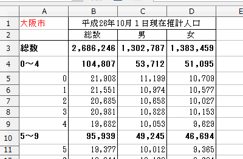

`readxl`での読み込みを試してみました。

```{r, message=FALSE}
library(readxl)
library(dplyr)
library(gistr)
```

## 元データ

[http://www.city.osaka.lg.jp/toshikeikaku/page/0000015211.html](大阪市市政　年齢別推計人口)にあるデータを使います。

```{r}
url <- "http://www.city.osaka.lg.jp/toshikeikaku/cmsfiles/contents/0000015/15211/suikei-nennrei2013-2014.xls"
tmp <- tempfile(fileext = ".xls")
download.file(url, tmp)
```

こんな感じのデータです。



ざっくり言って

* 上3行のデータはいらない（総数は自分で出す）
* 「X～Y」の行のデータもいらない

という雰囲気です。

## 読み込む

書くシートのタイトルは、区の名前になっています。「大阪市」は合計値なので、今回は省いて3枚目のシート以降を使います。
なんか謎のエラーっぽいのが出ますが怯まず先に進みます。。

```{r, warning=FALSE}
( districts <- excel_sheets(tmp) )
```

```{r, warning = FALSE, message = FALSE, results = "hide"}
data_list <- list()

for (i in 3:length(districts)) {
  district <- districts[i]
  data_part <- read_excel(tmp, sheet = district, skip = 3, col_names = FALSE)
  names(data_part) <- c("age", "total", "male", "female")

  data_part[data_part$age == "100～", "age"] <- "100"
  
  data_list[[district]] <- data_part %>%
    mutate(age = as.numeric(age),
           district = district) %>%
    filter(!is.na(age))
}
```

これをCSVとして書き出します。

```{r}
data_all <- bind_rows(data_list)
write.csv(data_all, file = "osaka_age_composition.csv", row.names = FALSE)
```

書き出したものは、https://github.com/yutannihilation/osaka_age_composition に置きました。